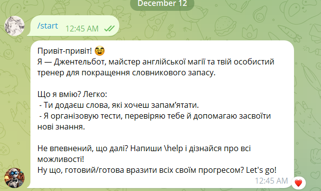
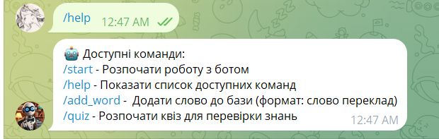
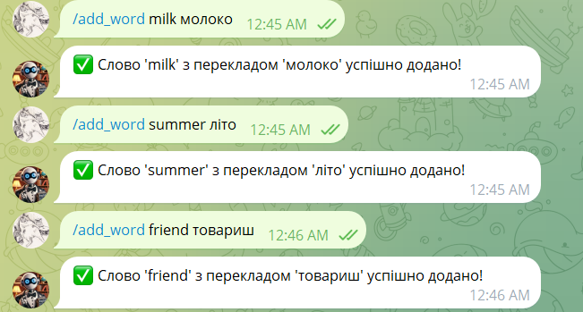
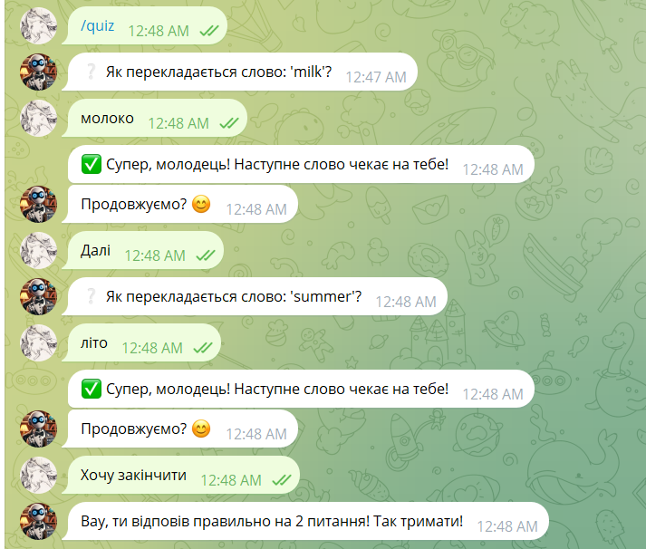

# Telegram Vocabulary Learning Bot (GentleBot @gentle_english_bot)

## Overview

This is a personal project I created to solve the problem of not being able to find suitable applications for learning new words. As someone who frequently learns new languages and expands vocabulary, I needed a tool that would seamlessly integrate into my daily life. I decided to build this bot using Telegram, as I use it daily both personally and professionally. Telegram offers a convenient platform, and by using it for this project, I can easily integrate vocabulary practice into my routine.

## Features

This bot allows users to:

- Add new words and their translations to the vocabulary database.
- Quiz themselves by testing their knowledge of new words.
- Keep track of their progress and improve vocabulary by regularly practicing.

### Bot Commands

Here are the available commands in the bot:

- `/start`  
  Starts the bot and sends a welcome message with instructions on how to use the bot.

- `/help`  
  Sends a list of all available commands to the user.

- `/add_word <word> <translation> [example]`  
  Adds a new word to the database. The word, its translation, and an optional example sentence can be provided. Example: /add_word apple яблоко "I ate an apple today."

- `/quiz`  
Starts a vocabulary quiz, where the bot sends random words and checks the user's answers.
User can continue the quiz and asks the next word or exit the quiz, and it will show the number of correct answers.

## Database Structure

The application uses SQLite as a database to store words and users. The structure includes the following tables:

- **Words**  
Stores vocabulary words with their translations and optional example sentences.  
Columns:  
- `id` (Primary Key)  
- `word` (String)  
- `translation` (String)  
- `example` (String, optional)

- **Users**  
Stores information about users who interact with the bot.  
Columns:  
- `id` (Primary Key)  
- `username` (String)  
- `email` (String)

## Running the Bot Locally

To run the bot for personal use, follow these steps:

1. Clone the repository: git clone <repository_url> cd <project_directory>
2. Set up a virtual environment: python -m venv venv source venv/bin/activate # On Windows use venv\Scripts\activate
3. Install dependencies: pip install -r requirements.txt
4. Set your bot's API token. You can obtain your API token by creating a bot through [BotFather](https://core.telegram.org/bots#botfather) on Telegram.
Create a `.env` file in the project directory with the following content: TELEGRAM_API_TOKEN=<your_bot_api_token>
5. Run the bot: python main.py

The bot will now be running, and you can interact with it on Telegram.

## Future Plans

I have several exciting improvements planned for the bot:

1. **Daily Reminders**:  
   I plan to implement daily reminders to encourage users to take the vocabulary test twice a day. This will help establish a routine and ensure regular practice.

2. **Word of the Day**:  
   Every day, the bot will send a selection of 5 random words (like a "word of the day" feature). This will serve as passive repetition to reinforce vocabulary.

3. **Batch Word Upload**:  
   I will add the ability to upload words in bulk through a file. This will allow users to easily add many words at once, making the process more efficient.

4. **Multiple Quiz Types**:  
   I want to add different types of tests, allowing users to choose between them. This will give users a variety of quiz formats to keep their learning experience engaging.

5. **Enhanced Statistics**:  
   I plan to introduce detailed statistics showing how often users answer correctly and whether they engage with the bot daily. This will help track progress and identify areas for improvement.

6. **Improved Quiz Algorithm**:  
   The quiz algorithm will be enhanced to provide more personalized word suggestions based on the user's performance. This will make the quizzes more tailored to the user's level and needs.

7. **Leaderboard and Streaks**:  
   I’ll implement a feature to track high scores and consecutive correct answers. Users will be able to compete against themselves or others to set records for the highest number of correct answers in a row.

8. **User-Based Data Segregation**:  
   The bot will be deployed, and the database will be segmented by user accounts. This will ensure that each user has their own set of words and statistics, making the bot more personalized.

These improvements will help make the bot more effective and engaging for users, transforming it into a more powerful tool for learning new vocabulary.

## Notes

This bot is designed for personal use and might be improved over time. It was created because I struggled to find a suitable tool to help me consistently learn and test new vocabulary words.